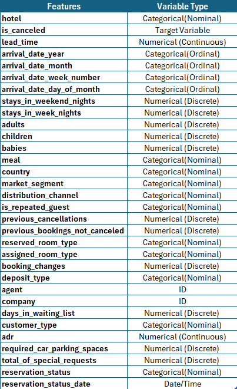
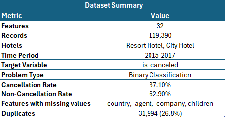
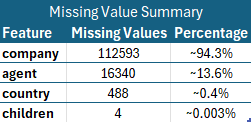
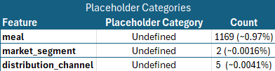

# Exploratory Data Analysis

<!-- brief intro to exploratory data analysis -->

The analysis is structured into four stages:

1. Univariate Analysis
2. Bivariate Analysis
3. Multivariate Analysis
4. Statistical Analysis

## Brief Dataset Overview

<table align="center">
<tr>
<td align="center">
 
<b>Feature Types</b>
</td>

<td align="center">
 
<b>Dataset Summary</b>
</td>
</tr>

<tr>
<td align="center">
 
<b>Missing Value Summary</b>
</td>

<td align="center">
 
<b>Placeholder Categories</b>
</td>
</tr>
</table>

## Univariate Analysis: Key Findings

<!-- Brief Intro  -->

- Approximately 37% of bookings were cancelled.
- Most bookings are made by transient customers.
- Bed & Breakfast (BB) is the most frequently selected meal plan.
- Portugal (PRT) contributes the largest share of bookings.
- Online and Offline Travel Agencies generate most reservations.
- The majority of bookings involve two adults with no children or babies.
- Most guests are first-time customers rather than repeat visitors.
- Previous cancellations and waiting-list bookings are rare.
- Most bookings do not require parking spaces.
- Most reservations undergo no booking modifications.

## Bivariate Analysis: Key Findings

<!--  -->

- Longer lead times were associated with higher cancellation rates.
- Deposit type showed a strong relationship with booking cancellations.
- Repeat guests were less likely to cancel than first-time customers.
- Previous cancellations were a strong indicator of future cancellations.
- Market segment and distribution channel influenced cancellation behaviour.
- Cancellation rates varied across countries.
- Arrival year showed little impact on cancellation behaviour.
- Arrival week captured more variation than arrival month.
- Short stays were generally more likely to be cancelled.
- Customers making special requests tended to have lower cancellation rates.

## Multivariate Analysis: Key Findings

### Lead Time, ADR and Cancellation Behaviour

- Cancellation rates generally increased as lead time increased.
- Customers booking far in advance exhibited the highest cancellation probabilities.
- ADR showed a weaker relationship with cancellations than lead time.
- The interaction between lead time and ADR suggests booking timing is a stronger indicator of cancellation risk than room price alone.

### Market Segment and Distribution Channel

- Strong dependencies exist between market segments and distribution channels.
- Online and Offline Travel Agencies primarily operate through TA/TO distribution channels.
- Direct market segments are overwhelmingly associated with direct booking channels.
- These relationships indicate that some variables may contain overlapping information.

### Market Segment, Distribution Channel and Customer Type

- Customer type distributions varied substantially across booking channels and market segments.
- Transient customers dominated the majority of booking combinations.
- Group bookings were concentrated within specific market segment and distribution channel combinations.
- Contract customers represented only a small proportion of overall bookings.

### Market Segment, Deposit Type and Cancellation Behaviour

- Deposit type demonstrated one of the strongest interactions with cancellation rates.
- Bookings with non-refundable deposits generally exhibited higher cancellation rates.
- The impact of deposit policies varied across market segments.
- Certain market segment and deposit type combinations showed extremely high cancellation probabilities, highlighting segments that may require targeted cancellation management strategies.

## Statistical Analysis

## Key Findings